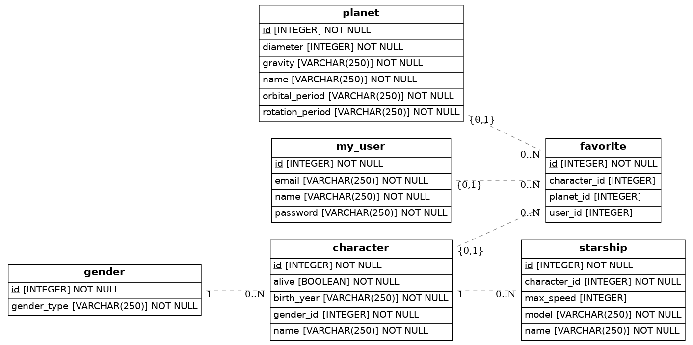

<!--hide-->
# 🚀 StarWars Blog Database
<!--endhide-->

  

## 📝 Purpose

Create the Entity Relationship Diagram for your StarWars Blog Database

## 📝 Instructions

- Must have a table `User` that will represent users blog.
- Blog users should be able to login and save their favorite planets and characters.
- The database should store the user favorites.
- The database should store characters and planets.
- What other tables do you think a blog like this might have?
- What properties should go inside the user? or inside the Character or Favorite table?
- What are the relationships between those tables?
- Add at least 4 models with all of their properties.

# 👨‍💻 Technologies
- The project is using the SQLAlchemy Python library to generate the database.

# 👥 Contributors
This and many other projects are built by students as part of the 4Geeks Academy [Coding Bootcamp](https://4geeksacademy.com/us/coding-bootcamp) by [Alejandro Sanchez](https://twitter.com/alesanchezr) and many other contributors. Find out more about our [Full Stack Developer Course](https://4geeksacademy.com/us/coding-bootcamps/part-time-full-stack-developer), and [Data Science Bootcamp](https://4geeksacademy.com/us/coding-bootcamps/datascience-machine-learning).